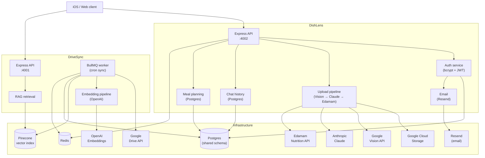

# Architecture

## Monorepo layout

```
lens-and-sync/
├── apps/
│   ├── dish-lens/      # Food-analysis API  (port 4002)
│   └── drive-sync/     # Drive → Pinecone sync worker  (port 4001)
├── packages/
│   ├── shared-auth/    # JWT sign/verify + requireAuth middleware
│   ├── shared-config/  # loadEnv + Zod schema helpers
│   ├── shared-db/      # Prisma client + schema
│   ├── shared-logger/  # Pino logger factory + security events
│   ├── shared-types/   # Cross-service TypeScript types
│   └── shared-utils/   # Express middleware (HTTPS, 404, error handler)
├── docs/               # This documentation site (VitePress)
└── infra/
    ├── docker-compose.yml
    └── terraform/
```

## Service interactions



## Authentication flow

Both services share the same JWT scheme. DishLens issues tokens; DriveSync only verifies them.

```
POST /auth/register  ──►  bcrypt hash  ──►  Postgres User row
                     ◄──  access + refresh tokens (JWT, signed with separate secrets)

POST /auth/login     ──►  bcrypt compare  ──►  issue token pair
POST /auth/refresh   ──►  sha256(token) lookup in RefreshToken table
                          revoke old row  ──►  issue new token pair
POST /auth/logout    ──►  revoke refresh token row
```

Email-based flows (verification, OTP, reset) store a `sha256(token)` in the `VerificationToken` table with an expiry and single-use flag.

## Database schema (shared)

```
User ──── RefreshToken (1:N)
     ──── SavedChat    (1:N)
     ──── MealPlan     (1:N) ──── MealEntry (1:N)
     ──── VerificationToken (1:N)

DriveFile  (DriveSync only)
```

## Sync worker lifecycle

```
Cron trigger (BullMQ)
  └─► Acquire Redis lock  (prevents overlap with manual triggers)
        └─► List Drive folders  ──►  detectChanges vs Postgres DriveFile rows
              ├─► New / updated files:
              │     extractText → computeContentHash → shouldReembed?
              │       └─► chunkText → generateEmbeddings → upsertChunkVectors
              │             └─► upsertSyncState (Postgres)
              └─► Deleted files:
                    deleteVectorsForFile (Pinecone) → deleteSyncState (Postgres)
  └─► Release lock  ──►  writeSyncStatus (Redis)
```
